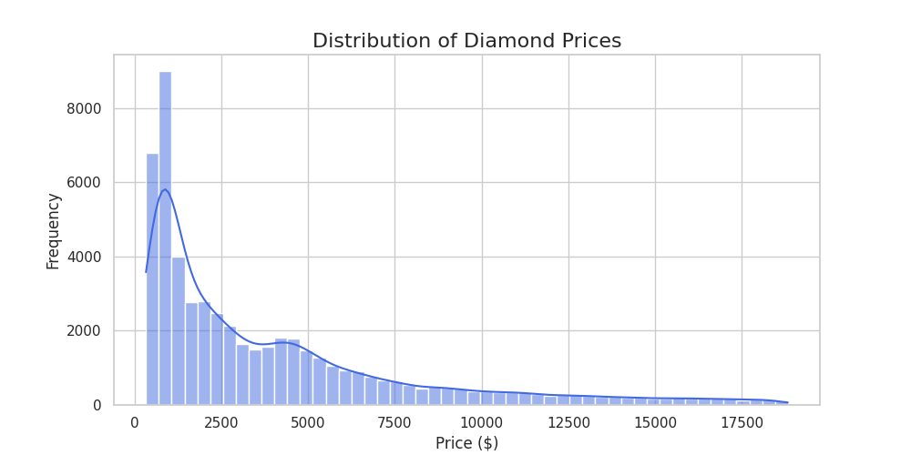
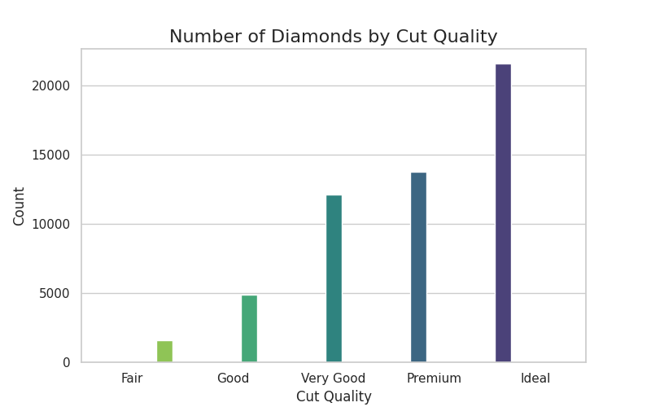
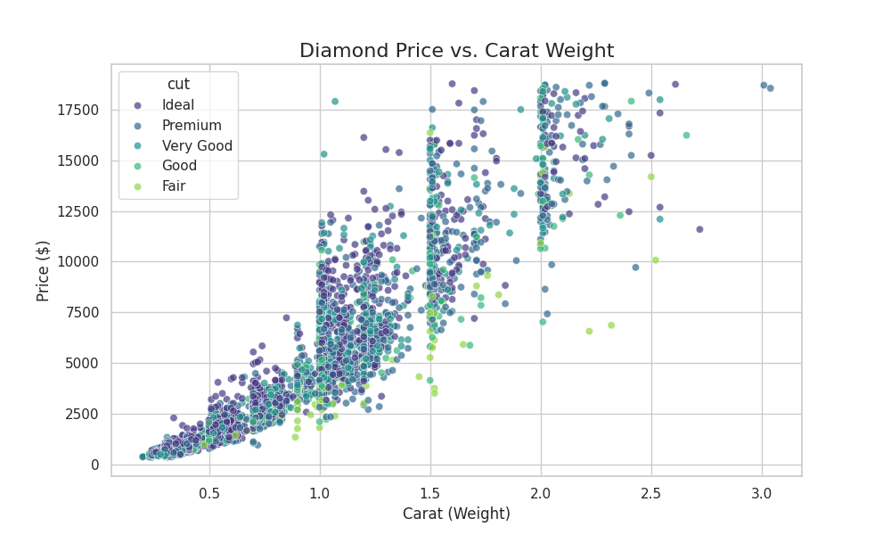
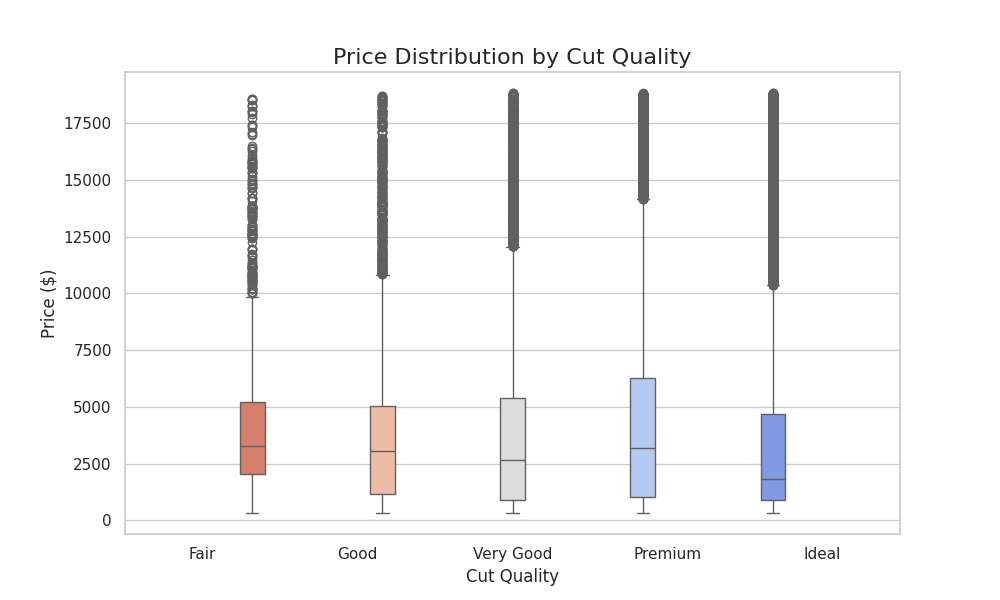
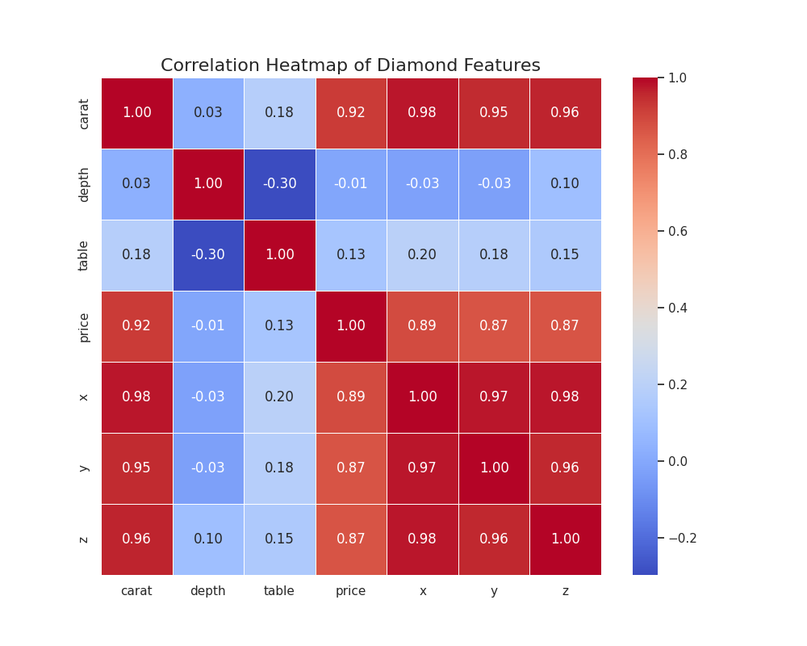

# 🔍 CodeAlpha_ExploratoryDataAnalysis

Exploratory Data Analysis (EDA) on the Diamonds dataset for the CodeAlpha Data Analytics Internship. This Python data analytics project uses Pandas, Seaborn, and Matplotlib to uncover trends, patterns, correlations, outliers, and business insights in diamond pricing data through statistical analysis and visualization.


🌟 **Intern:** Prinkle Kella | **CodeAlpha Data Analytics Internship** | **June 2026**

---

## 🎯 Project Objective

The objective of this task was to perform Exploratory Data Analysis (EDA) on a real-world dataset to uncover underlying structures, detect outliers, identify important variables, and test assumptions using statistical graphics.

This project focuses on understanding how different diamond attributes such as carat, cut, color, clarity, depth, table, and dimensions affect diamond pricing.

---

## 🛠️ Tools & Technologies

* **Python 3.12**
* **Pandas:** Data manipulation, health checks, and cleaning
* **Seaborn:** Statistical data visualization using histograms, scatterplots, boxplots, countplots, and heatmaps
* **Matplotlib:** Base plotting and chart customization
* **NumPy:** Numerical operations

---

## 📊 Dataset Source

* **Dataset:** Seaborn Built-in Diamonds Dataset
* **Description:** Contains prices and attributes of almost 54,000 diamonds.
* **Features:** Carat, Cut, Color, Clarity, Depth, Table, Price, and Dimensions (`x`, `y`, `z`).

---

## ⚙️ Methodology & Implementation

### 1. Data Loading & Health Check

Loaded the Diamonds dataset using Seaborn and conducted an initial health check using:

* `.info()`
* `.describe()`
* `.isnull().sum()`

### 2. Data Cleaning

Identified logical errors where diamond dimensions (`x`, `y`, `z`) were recorded as 0. These 20 invalid rows were removed to maintain data integrity and improve analysis accuracy.

### 3. Univariate Analysis

* Plotted a histogram to understand the price distribution.
* Created a countplot to analyze the frequency of diamond cut categories.

### 4. Bivariate Analysis

* Used a scatterplot to observe the relationship between carat and price.
* Used a boxplot to compare price distributions across different cut qualities and detect outliers.

### 5. Multivariate Analysis

Generated a correlation heatmap to quantify the linear relationships between numeric variables such as price, carat, depth, table, and dimensions.

---

## 📸 Output Previews

### 1. Price Distribution (Histogram)



**Insight:** The price distribution is right-skewed. Most diamonds are affordable and fall in the lower price range, while very expensive diamonds appear as rare outliers.

---

### 2. Count by Cut Quality (Countplot)



**Insight:** Ideal cut diamonds are the most common in the dataset, followed by Premium and Very Good cuts.

---

### 3. Price vs Carat Weight (Scatterplot)



**Insight:** There is a strong positive relationship between carat weight and price. As carat increases, the price generally increases significantly.

---

### 4. Price by Cut Quality (Boxplot)



**Insight:** The boxplot shows that each cut category contains several high-price outliers. These outliers are usually larger diamonds where price is heavily influenced by carat weight.

---

### 5. Feature Correlation (Heatmap)



**Insight:** Carat has the strongest positive correlation with price, making it the most important pricing factor. Diamond dimensions (`x`, `y`, `z`) also show strong correlation with both carat and price.

---

## 💡 Key Learnings & Insights

### Right-Skewed Prices

The vast majority of diamonds are priced at the lower end, while extremely expensive diamonds are rare outliers.

### Carat is King

The correlation heatmap shows a strong relationship between carat and price. Weight is the primary driver of diamond cost.

### The Cut Paradox

Interestingly, Fair and Good cuts can show higher median prices than Ideal cuts. This happens because large and heavy diamonds may not always receive Ideal cuts, as jewelers often prioritize retaining carat weight over perfect symmetry.

### Understanding Outliers

The boxplot revealed many high-price outliers. These outliers are usually diamonds with higher carat weight, which increases price even if the cut quality is not the best.

---

## 🚀 How to Run Locally

### Clone the Repository

```bash
git clone https://github.com/PrinkleMahshwari/CodeAlpha_ExploratoryDataAnalysis.git
```

### Navigate to the Project Directory

```bash
cd CodeAlpha_ExploratoryDataAnalysis
```

### Install Required Libraries

```bash
pip install -r requirements.txt
```

### Run the EDA Script

```bash
python src/eda.py
```

---

## 📂 Project Structure

```text
CodeAlpha_ExploratoryDataAnalysis/
├── data/                   # Dataset files
│   └── diamonds.csv        # Exported dataset
├── screenshots/            # Output visualizations
│   ├── carat_vs_price.png
│   ├── correlation_heatmap.png
│   ├── cut_count.png
│   ├── price_by_cut.png
│   └── price_distribution.png
├── src/                    # Source code directory
│   └── eda.py              # Main EDA script
├── README.md               # Project documentation
└── requirements.txt        # Python dependencies
```

---

## 🙏 Acknowledgements

This project was completed as part of the **CodeAlpha Data Analytics Internship Program**.

* **Dataset Source:** Seaborn Built-in Datasets
* **Internship Organization:** [CodeAlpha](https://www.codealpha.tech/)
* **Repository:** [CodeAlpha_ExploratoryDataAnalysis](https://github.com/PrinkleMahshwari/CodeAlpha_ExploratoryDataAnalysis)

Special thanks to **CodeAlpha** for providing this internship opportunity and to the open-source Python community for the tools used in this project.

---

## 🔗 Important Links

| Resource                | Link                                                                                                       |
| ----------------------- | ---------------------------------------------------------------------------------------------------------- |
| Internship Organization | [CodeAlpha](https://www.codealpha.tech/)                                                                   |
| GitHub Repository       | [CodeAlpha_ExploratoryDataAnalysis](https://github.com/PrinkleMahshwari/CodeAlpha_ExploratoryDataAnalysis) |
| GitHub Profile          | [PrinkleMahshwari](https://github.com/PrinkleMahshwari)                                                    |

---

## 📈 Skills Gained

Through this project, I gained practical experience in:

* Exploratory Data Analysis (EDA)
* Data Cleaning & Data Preprocessing
* Statistical Data Analysis
* Data Visualization
* Pandas DataFrames
* Seaborn Visualizations
* Matplotlib Charts
* Correlation Analysis
* Outlier Detection
* Feature Engineering Understanding
* Business Insight Extraction
* Python for Data Analytics
* Git & GitHub Documentation

---

## 🚀 Future Improvements

Possible future improvements for this project include:

* Building Machine Learning models to predict diamond prices
* Analyzing the impact of Color and Clarity on pricing
* Creating interactive dashboards using Streamlit
* Developing Power BI dashboards for business reporting
* Applying advanced outlier detection techniques such as IQR and Z-Score methods
* Performing feature importance analysis using machine learning algorithms

---

## 🎥 LinkedIn Project Demonstration

As part of the CodeAlpha Internship requirements, a project explanation video has been published on LinkedIn.

**Status:** Done ✅

**LinkedIn Post Link:** [View LinkedIn Project Demonstration](https://www.linkedin.com/posts/prinkle-maheshwari-544417292_dataanalytics-eda-python-ugcPost-7470146925330350080-hy6o/)**
---

## ⭐ Internship Progress

| Task                      | Status      |
| ------------------------- | ----------- |
| Web Scraping              | ✅ Completed |
| Exploratory Data Analysis | ✅ Completed |
| Data Visualization        | ⏳ Pending   |
| Sentiment Analysis        | ⏳ Pending   |

---

## 📜 License

This project was developed for educational purposes and as part of the CodeAlpha Data Analytics Internship Program.

---

## 👨‍💻 Author

**Prinkle Kella**

BS Software Engineering Student | Data Analytics Intern

* GitHub: [PrinkleMahshwari](https://github.com/PrinkleMahshwari)
* LinkedIn: [Project Demonstration Video](https://www.linkedin.com/posts/prinkle-maheshwari-544417292_dataanalytics-eda-python-ugcPost-7470146925330350080-hy6o/)
* Project: **CodeAlpha_ExploratoryDataAnalysis**
* Internship: **CodeAlpha Data Analytics Internship**

Thank you for visiting this repository. Feedback, suggestions, and improvements are always welcome.

---

## 🔎 SEO Keywords

`Exploratory Data Analysis`, `EDA Project`, `Diamonds Dataset`, `Python Data Analytics`, `Pandas`, `Seaborn`, `Matplotlib`, `Data Visualization`, `Correlation Analysis`, `Outlier Detection`, `CodeAlpha Internship`, `Python Project`, `Data Science Portfolio`, `Statistical Analysis`, `Business Intelligence`
